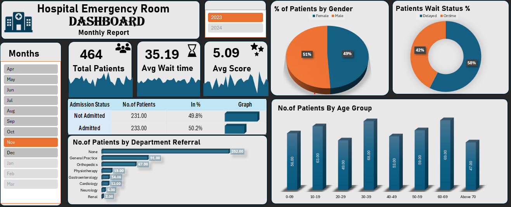

# 🏥 Hospital Emergency Room Dashboard  
**Monthly Report - November 2023**

---

## 📊 Dashboard Overview  
The Hospital Emergency Room dashboard provides a comprehensive view of patient inflow, departmental referrals, admission trends, and service quality metrics. The dashboard is designed to help hospital administrators monitor and enhance emergency room operations and patient care efficiency.

---

## 📁 Dataset Used  
- **Dataset Name:** <a href="https://github.com/Francis-145/Hospital-Dashboard/blob/main/Data.csv"><a/>  
- **Source:** Hospital internal patient management system  
- **Format:** Excel (.xlsx)

---

## ❓ Questions / KPIs Addressed  
- 👥 How many total patients visited the emergency room in the selected month?  
- ⏱️ What was the average wait time?  
- ⭐ What was the average patient satisfaction score?  
- 🏥 How many patients were admitted vs not admitted?  
- ⚧️ What is the patient distribution by gender?  
- ⌛ What percentage of patients were seen on time vs delayed?  
- 🏬 What are the most referred departments?  
- 👶👵 What is the age group distribution of patients?

---

## 🛠️ Process Followed  
1. Verified and cleaned raw patient data for missing values and anomalies.  
2. Standardized data types, formats, and categorical labels.  
3. Created **Pivot Tables and Pivot Charts** to summarize key performance indicators.  
4. Designed an **interactive Excel dashboard** with slicers for month and year selection.  
5. Visualized insights using bar charts, pie charts, and KPI cards.

---

## 📸 Dashboard Snapshot  
  
*Interactive view available in Excel version.*

---

## 💡 Project Insights  
- 👥 **Total Patients** treated in November 2023: **464**  
- ⏱️ **Average Wait Time**: **35.19 minutes**  
- ⭐ **Average Patient Satisfaction Score**: **5.09**  
- 🏥 **Admissions**: ~**50%** of patients were admitted  
- ⚧️ **Gender Distribution**: **51% Female**, **49% Male**  
- ⌛ **Wait Time Status**: **58% On Time**, **42% Delayed**  
- 🏬 **Top Department Referrals**:  
  - General Practice (91)  
  - Orthopedics (67)  
  - Physiotherapy (19)  
- 👶👵 **Top Age Groups**:  
  - 30–39 years (68 patients)  
  - 60–69 years (68 patients)  
  - 10–19 years (63 patients)

---

## 📌 Final Conclusion  
The dashboard provides hospital management with clear visibility into ER operations. In November 2023:  
- Patient admission and referral data indicate balanced inflow across key departments.  
- **Delays in wait times** (42%) highlight an area for service optimization.  
- Targeted improvements in staffing and triage processes during peak hours can enhance on-time care.  
- Special attention should be given to high-volume age groups (30–39 and 60–69) for capacity planning.

---

